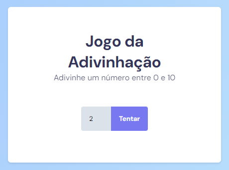
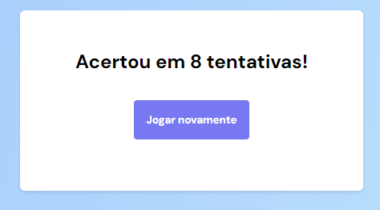

<h1 align="center">
Jogo de Adivinhação
</h1>

  
  

## Tecnologias

Esse projeto foi desenvolvido com as seguintes tecnologias:

- JavaScript
<!-- - [Node.js](https://nodejs.org/en/)
- [React](https://reactjs.org)
- [React Native](https://facebook.github.io/react-native/)
- [Expo](https://expo.io/) -->

## 💻 Projeto

O Jogo de Adivinhação consiste no usuário digitar um número de 1 a 10 e tentar acertar no mínimo de tentativas possíveis.

## 🤔 Como contribuir

- Faça um fork desse repositório;
- Cria uma branch com a sua feature: `git checkout -b minha-feature`;
- Faça commit das suas alterações: `git commit -m 'feat: Minha nova feature'`;
- Faça push para a sua branch: `git push origin minha-feature`.

Depois que o merge da sua pull request for feito, você pode deletar a sua branch.

## Licença

Esse projeto está sob a licença MIT. Veja o arquivo [LICENSE](LICENSE.md) para mais detalhes.

